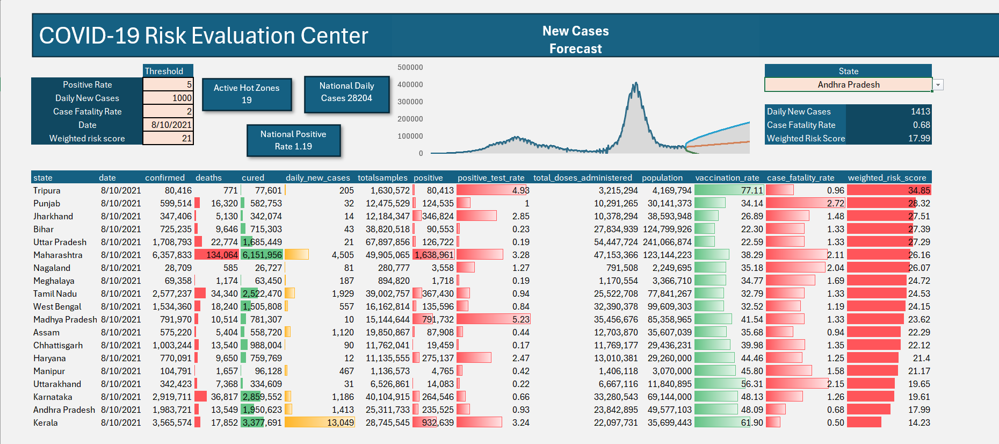

# Technical Documentation: COVID-19 Risk Evaluation Center

## 1. Overview and Intent
The COVID-19 Risk Evaluation Center is a dynamic, interactive Excel dashboard designed for diagnostic tracking and surveillance. Its primary intent is to serve as a command center for stakeholders, allowing them to instantly identify high-risk states ("Hot Zones") based on customizable medical thresholds, while simultaneously maintaining a view of overall national metrics.

Unlike static reports, this tool relies on a calculation engine that updates all visualizations, counts, and metrics automatically when a user alters the input variables.

---


## 2. The Control Panel (Dynamic Inputs)
Located in the top-left corner, the Control Panel drives the logic for the entire dashboard. Users define the risk parameters here.

**Inputs:**

* **Positive Rate:** The percentage of total tests returning positive.
* **Daily New Cases:** The absolute count of new infections.
* **Case Fatality Rate (CFR):** The percentage of confirmed cases resulting in death.
* **Date:** The specific point in time to analyze (powered by a reverse-chronological dynamic dropdown).
* **Weighted Risk Score:** A composite calculation metric representing overall regional danger.

**Intent:** By exposing these variables to the user, the dashboard can be adjusted for different phases of the pandemic (e.g., early warning sensitivity vs. worst-case scenario tracking).

---

## 3. The Calculation Engine (Dynamic Hot Zone Table)
The core of the dashboard is the filtered data table at the bottom. It only displays states that have breached the defined thresholds for the selected date.

**The Formula Logic:**

```excel
=SORT(FILTER(covid_data, 
  ((covid_data[positive_test_rate] >= [Positivity_Cell]) + 
   (covid_data[daily_new_cases] >= [Daily_Cases_Cell]) + 
   (covid_data[case_fatality_rate] >= [CFR_Cell]) + 
   (covid_data[weighted_risk_score] >= [Risk_Score_Cell])) 
  * (covid_data[date] = [Date_Cell]), 
"No Match"), 14, -1)
```

**Technical Explanation:**

* The `+` symbols act as logical **OR** operators. A state is flagged if it breaches *any* of the individual thresholds.
* The `*` symbol acts as a logical **AND** operator. The data must strictly match the selected date.
* The `SORT` function wraps the entire array, organizing the final list by column 14 (Weighted Risk Score) in descending order (`-1`), ensuring the highest-risk regions remain at the top.

---

## 4. Top-Level KPIs (Macro View)
These summary cards provide an immediate national snapshot based on the selected date and active filters.

* **Active Hot Zones:** Counts the number of states currently appearing in the filtered table.
    * *Formula:* `=IF([First_Cell_Of_Table]="No Match", 0, ROWS([First_Cell_Of_Table]#))`
* **National Daily Cases:** The total sum of new cases across the entire country for the selected date, regardless of the filter thresholds.
    * *Formula:* `=SUMIFS(covid_data[daily_new_cases], covid_data[date], [Date_Cell])`
* **National Positive Rate:** The true weighted average of positivity for the country on the selected date.
    * *Formula:* `=SUMIFS(covid_data[positive], covid_data[date], [Date_Cell]) / SUMIFS(covid_data[totalsamples], covid_data[date], [Date_Cell])`

---

## 5. State Deep-Dive Profiler (Micro View)
Located on the top right, this tool allows a user to isolate and examine a specific state's performance without disrupting the main Hot Zone table.

**The Formula Logic (2-Criteria XLOOKUP):**

```excel
=XLOOKUP(1, (covid_data[state]=[State_Dropdown_Cell]) * (covid_data[date]=[Date_Cell]), covid_data[daily_new_cases], "No Data")
```

**Technical Explanation:**

This formula multiplies two arrays together. It searches for the single row in the master data table where the State column matches the user selection AND the Date column matches the Control Panel date, returning the specific requested metric.

---

## 6. Visual Formatting & UX
To ensure critical data is absorbed quickly, the dashboard utilizes automated visual cues.

* **Conditional Formatting (Alert Rows):** Entire rows in the Hot Zone table are highlighted in red if their respective `weighted_risk_score` exceeds the threshold defined in the Control Panel. 
* **In-Cell Data Bars:** Applied to columns like 'positive', 'cured', and 'weighted_risk_score' to provide instant, horizontal bar charts representing scale without requiring the user to read raw integers.