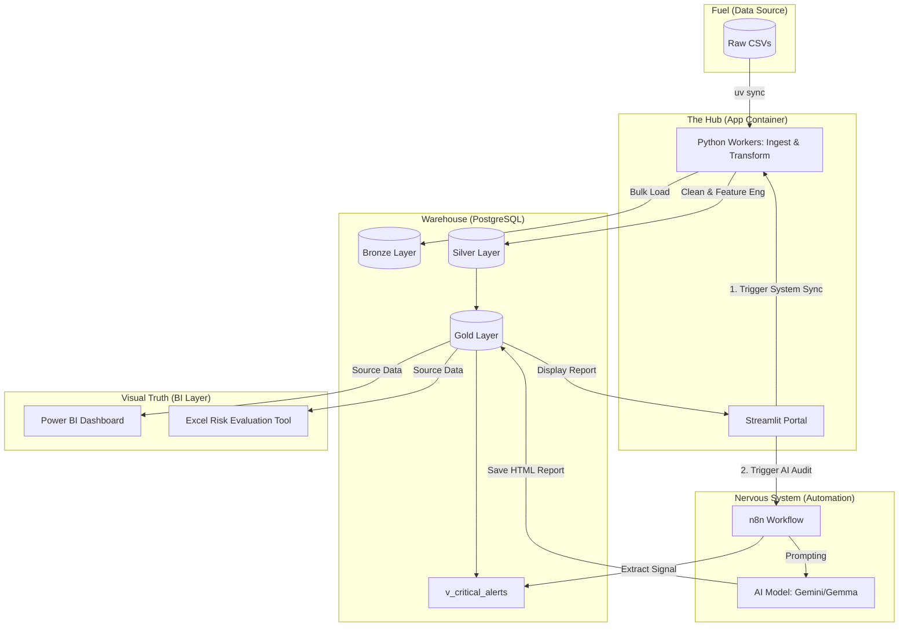

# End-to-End COVID-19 Intelligence & AI Reporting System

Welcome to the central documentation for the **COVID-19 Surveillance & AI Early Warning Portal**. This system integrates high-performance Data Engineering (Medallion Architecture), Generative AI (Google Gemini/Gemma), and Business Intelligence (Power BI/Excel) into a unified executive command center.

---

## System Architecture & Data Flow

The following diagram illustrates the modern, consolidated setup where the `app` service manages both the **Executive UI** and the **ETL Orchestration**.



---

## Knowledge Base (In-Depth Guides)

Navigate the project's specialized documentation for technical and strategic details:

### **1. Strategic Foundation**
*   **[Business Context](./business_context.md)**: Industry background, stakeholder personas, and the specific **Risk Formulas** (Weighted Risk Scores) used to flag outbreaks.
*   **[AI Intelligence Setup](./ai_intelligence_setup.md)**: A complete map of SQL Data Signals combined with optimized System Prompts for AI models.

### **2. Technical Infrastructure**
*   **[Infrastructure & Deployment](./infrastructure.md)**: Details on the Dockerized setup, `.env` credential management, and "self-healing" volumes.
*   **[n8n Automation Logic](./n8n_workflow.md)**: Breakdown of the surveillance blueprints and the human-in-the-loop feedback handler.

### **3. Analysis & Insights**
*   **[Power BI Analysis](./powerbi_analysis.md)**: DAX measures and visual goals for national situational awareness.
*   **[Excel Risk Evaluation](./excel_analysis.md)**: Formula-driven templates for surgical audits, dynamic threshold tuning, and specific stakeholder questions.

---

## The Control Plane: Quick Actions

| Feature | Action | Stakeholder Value |
| :--- | :--- | :--- |
| **Trigger ETL Pipeline** | Wipes staging, re-ingests CSVs, and runs Silver/Gold ETL. | Ensures the warehouse reflects the latest raw data drops. |
| **Run AI Risk Audit** | Triggers n8n to query the Gold Layer and generate an AI report. | Provides qualitative, human-readable strategy on top of the numbers. |
| **Active Alert Table** | Displays the top 10 states exceeding risk thresholds. | Immediate identification of national "Hot Zones." |

---

## Why This is Exciting: Dynamic Intelligence
Unlike static dashboards, this system is a **living engine**. 

*   **Customizable Brains**: You can change the **System Prompts** and **SQL Data Signals** inside n8n to pivot the AI from an "Epidemiologist Persona" to a "Logistics Officer Persona."
*   **Model Agnostic**: Currently optimized for Gemini 1.5 Pro and open-source models like Gemma3. n8n allows you to swap in any model as required.
*   **Powerful Reporting**: The more context you provide in the SQL query, the more qualitative and strategic the AI briefings become.

---

## Future Roadmap
The following features are slated for future development to enhance stakeholder autonomy:

*   **Self-Service Prompting**: A UI component to allow users to override system prompts with specific situational context.
*   **SQL Exploration Engine**: A "Sandbox" tab where users can run safe, read-only SQL queries against the Gold layer.
*   **Local GenAI (Ollama)**: Support for running the Nervous System entirely on local hardware for maximum privacy.
*   **Persona-Based Defaults**: Intelligent UI presets tailored for 'Public Health Officials', 'Logistics Managers', and 'Executive Leadership'.

---

## Quick Launch
Ready to deploy? Ensure your `.env` is configured and run:
```bash
docker-compose up -d
```
Visit the portal at `http://localhost:8501`. For n8n workflow activation steps, refer to the [n8n Workflow Setup](./n8n_workflow.md).
