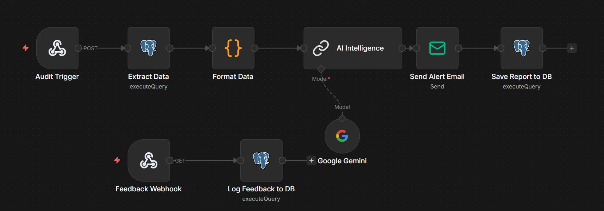

# Automation Blueprints (n8n Logic)

The system's "Surveillance" and "Human-in-the-Loop" capabilities are powered by **n8n**. This document breaks down the logic inside the `n8n_workflows/Refined_Alert_System.json` blueprint.

---

## High-Level Logic Flow

The workflow is divided into two main execution paths:

1.  **The AI Risk Audit**: Pulls data → Asks Gemini → Sends Email → Saves Report.
2.  **The Feedback Handler**: Receives Link Click → Writes Confirmation to DB.

---

## Path 1: The AI Risk Audit (Trigger-Based)

### **1. Audit Trigger (Webhook)**
*   **Role**: Listens for a POST request from the Streamlit "Run AI Audit" button.
*   **Production URL**: `http://localhost:5678/webhook/audit-trigger`

### **2. Postgres Data Pull**
*   **Query**: Selects the top 10 states from `v_critical_alerts` for the latest date.
*   **Why**: By using a SQL View, we keep the n8n logic simple. If we want to change the "definition" of a crisis, we update the SQL View, not the n8n node.

### **3. Gemini AI Analysis (The Intelligence)**
*   **Model**: `gemini3.0-flash` or any other as required is available.
*   **Role**: Converts the raw JSON numbers into a structured HTML situation report. 
*   **Key Instruction**: Forces the model to return **raw HTML** with inline CSS, ensuring the report looks perfect in both Gmail and the Streamlit Portal.

### **4. Save & Send (Dual Destination)**
*   **Email Node**: Dispatches the briefing to the Chief Medical Officer.
*   **Postgres Write Node**: Saves the HTML string into the `latest_ai_report` table so the Streamlit app can display it.

---

## Path 2: The Feedback Loop (Human-in-the-Loop)

This is what makes the system "Smart" over time.

### **1. Feedback Webhook**
*   **URL**: `http://localhost:5678/webhook/covid-feedback`
*   **Mechanism**: The AI inserts two links in the email:
    *   `...status=Confirmed`
    *   `...status=False Positive`

### **2. Logging the Truth**
When a stakeholder clicks a link, n8n extracts the `status`, `state`, and `date` from the URL parameters and inserts them into the `alert_feedback` table.

---

## Credential Management

To run this blueprint, you must configure two credentials in n8n:

1.  **Postgres Credentials**:

    *   Host: `db` (internal Docker name)
    *   Database: `postgres`
    *   User: `postgres`
    *   Password: `password123`

2.  **Google Gemini Credentials**:

    *   Requires a **Google AI API Key** from the Google AI Studio.

---

## Troubleshooting the "Audit"
If the audit fails to generate a report:

*   **Check the Postgres Node**: Ensure the app container has finished running the ETL (Gold layer must exist).
*   **Check Gemini Quotas**: Ensure your API key is active and hasn't hit its free-tier rate limit.
*   **Inspect n8n Executions**: Use the "Executions" tab in n8n to see exactly which node failed and read the error message.
